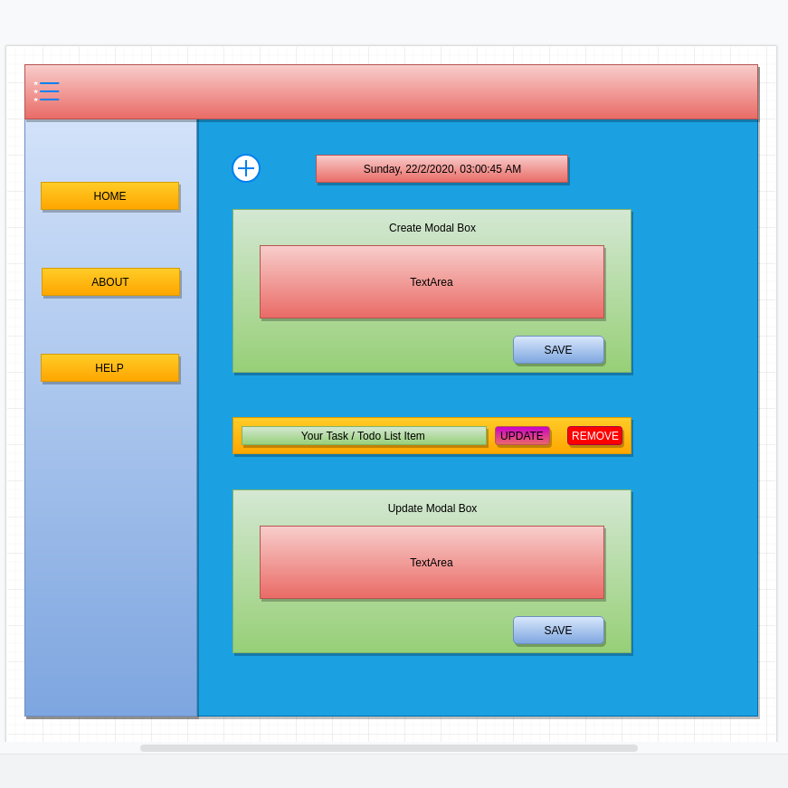

# SSRtodo
  Just Todo app using SSR with Next.js to implement MERN stack and can be used as  `Next.js Boilerplate / Starter Kit` . Please Check the `RELEASE_STATUS` before you clone. Here is a deployed link [DeploymentLink](https://todogql-react.now.sh)

## RELEASE_STATUS:IN PROGRESS
## RELEASE_CODE: GDEV005
 Sorry this project is not completely done yet but most features are available to try out. If you are considering about cloning this project please wait till it's completed.

## Description
 If you wanna try it on your own then clone the `SERVER-SIDE-REPOSITORY` first then use your own `MONGO_URI` , create `ENV` file and then run `start` or `dev` whatever u like and if it went without errors then clone this `CLIENT-SIDE` repo and start the application. I'm sure there will be a few or more errors as this project is not completely done for both `CLIENT` and `SERVER`. I would appreciate if you fork it on your own acc then tweek it as u like!.
    
Mockup Design Chart for this app:

